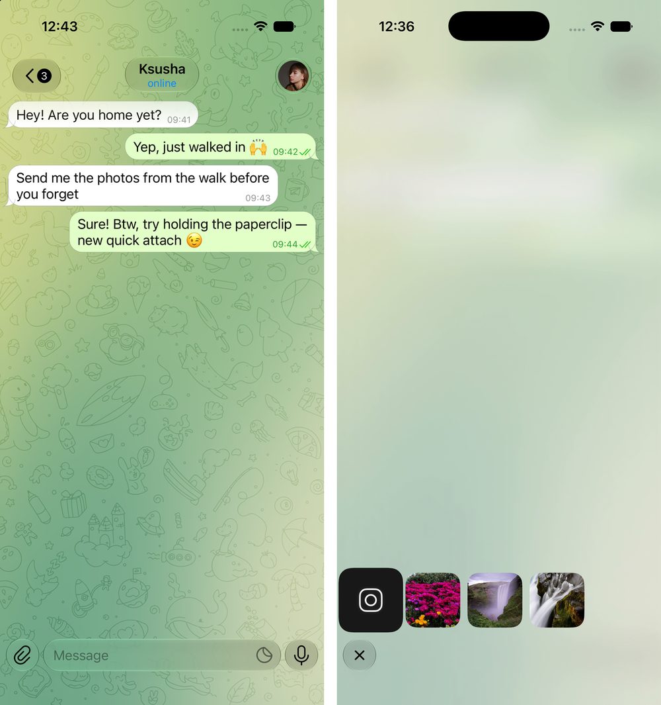

# QuickAttach

A UIKit demo that rebuilds Telegram's iOS chat screen and adds one thing Telegram
doesn't have: **quick attach on a long press**, the way ChatGPT does it.



## The problem

Sending a photo you just took costs four steps: tap the paperclip, wait for the
sheet, scroll to the photo, tap it. Almost every one of those sends is one of the
last few pictures in the roll.

Quick attach collapses that into a single gesture. Press and hold the paperclip
and four thumbnails fan out of it — a live camera viewfinder first, then the three
most recent photos. Keep holding, slide onto one, let go: it flies into the
composer as an attachment. Release over the button, or anywhere else, and
everything folds back into the paperclip. You never leave the chat.

## How it's built

No dependencies, UIKit only, iOS 16+ (glass surfaces need iOS 26 and fall back to
a blur below that).

**The screen** is transcribed from [Telegram-iOS](https://github.com/TelegramMessenger/Telegram-iOS)
rather than eyeballed: the stretchable bubble image with its ellipse-punched tail
and hairline stroke, the software gradient wallpaper (per-pixel kernel, four color
stops, swirl) with the doodle pattern in soft light, the wallpaper edge effect
under the navigation bar, and the glass header and composer. Bubble widths are
measured with CoreText the way Telegram measures them — the widest line sets the
width, and it only grows to fit the timestamp when the last line would collide
with it.

**The fan** is the interesting part. Cards are born at the center of the paperclip
icon, nearly circular and blurred, and resolve into rounded squares as they land.
A single spring would fly them in a straight line, so each card runs **two
independent springs — one on `position.x`, one on `position.y`** — with different
stiffness and damping. A fast, bouncy Y plus a slower, smoother X bends the path
into an arc while both axes keep real spring physics, which a keyframed parabola
would throw away. Cancelling replays that same arc backwards by swapping the two
axes' parameters, so the cards leave along the path they arrived on. All the
numbers live in `FanTuning.swift`.

```
QuickAttach/
├── QuickAttachOverlayView.swift  the fan: birth, flight, tracking, dismissal
├── FanTuning.swift               spring parameters for the fan
├── ChatInputPanelView.swift      composer, attachment chip
├── ChatViewController.swift      chat screen, wallpaper, header, gesture
├── ChatMessageCell.swift         message bubbles
├── TelegramGraphics.swift        bubble / check / chevron drawing
└── GlassSurfaceView.swift        UIGlassEffect wrapper with a fallback
```

## Running it

Open `QuickAttach.xcodeproj` in Xcode, pick an iPhone simulator, Run. Then press
and hold the paperclip.

Photo access is requested at launch; without it the fan falls back to generated
placeholders, so the gesture always works. The camera tile needs a real device.

## Credits

Graphics and drawing code are taken from Telegram-iOS, which is licensed under
GPL-2.0. The wallpaper pattern is Telegram's artwork. This is a UX prototype, not
a Telegram client.
